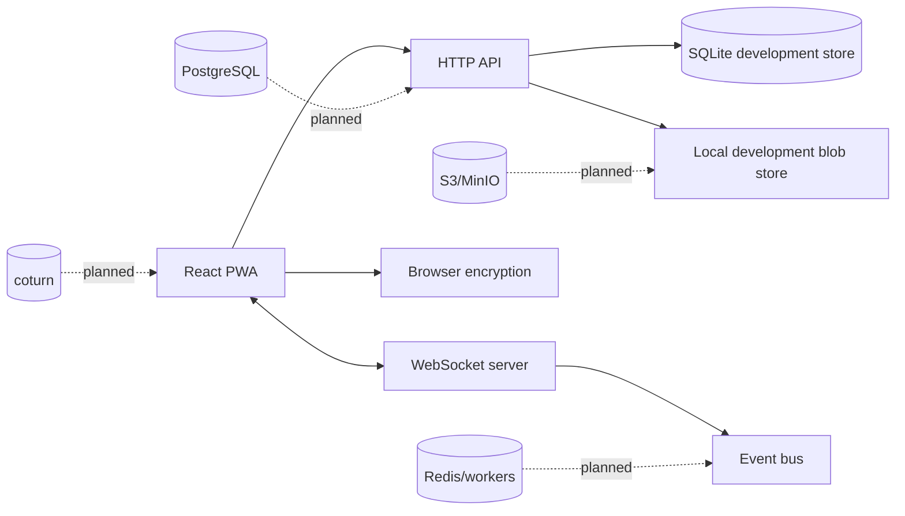

# FrontierX — Architecture

FrontierX is a local-first encrypted messenger built as an npm-workspaces monorepo. This document describes the current verified implementation and its deliberate limits.

> **Current state:** a tested encrypted PWA messenger foundation. It is not a production-ready Telegram-parity platform, a native mobile/desktop product, or an MLS/Signal-class multi-device protocol.

## Design principles

- Message and file plaintext are encrypted in the browser before API submission.
- File backups are opaque encrypted bundles; file keys are client-held.
- Authorization is based on authenticated account sessions and conversation membership.
- Persistent product state is maintained in the SQLite development store; production infrastructure remains a separate delivery.
- Every verified feature requires durable state where applicable, failure handling, and automated evidence.

## Monorepo layout

```text
packages/
  shared/       IDs, clock, Result helpers
  protocol/     conversation/member/event contracts
  crypto/       Node reference AEAD, file crypto, KDF helpers
  domain/       file lifecycle state machine
apps/
  api/          HTTP API, SQLite store, auth, event bus, WebSocket server
  web/          React/Vite PWA, browser crypto, local files, chat UI
```

## Server

`apps/api/src/store.ts` is the development persistence layer. It stores users, session-token hashes, conversations, memberships, messages, receipts, file records, pin/archive state, and encrypted drafts. No raw bearer token is stored.

`apps/api/src/auth.ts` issues random 256-bit bearer tokens. The database stores a SHA-256 token hash plus a durable session identifier, a user-agent-derived label, created time, last-seen time, and expiry. `authenticateSession` refreshes activity and enables owner-scoped remote revocation without exposing the token.

`apps/api/src/app.ts` provides JSON endpoints for authentication, profile update, session inventory/revocation, conversations, messages, drafts, organization features, encrypted file operations, and protected access control. `ws.ts` and `eventbus.ts` fan out authorized realtime events.

## Browser client

The React PWA stores its active session in browser state and exposes account and device management in the chat sidebar. The Account & Devices dialog supports display-name update, loading/error/empty session states, remote sign-out, and sign-out of other browsers.

The chat surface implements conversation navigation, archive filtering, role/member management, persisted pins, encrypted draft hydration/sync, local loaded-message search, encrypted message flow, and the local-first file panel.

## Cryptographic boundary

- Browser messages use WebCrypto AES-256-GCM with authenticated encryption and fresh per-message IVs.
- Browser file storage and transfer use encrypted chunk data, authenticated manifests, opaque backup bundles, and client-held keys.
- Existing wrapped conversation-key behavior does **not** provide a Signal Double Ratchet or MLS properties such as forward secrecy, post-compromise security, cryptographic device verification, or robust multi-device recovery.

## Runtime topology



Solid edges are used by the current development runtime. Dashed edges are not evidence of a deployed capability.

## Verification snapshot

The current full command set `npm test && npm run typecheck && npm run build` passed after the account/device implementation. It reported 99 passing tests and produced a Vite PWA build. That result does not replace browser E2E, load, security, or production-deployment validation.
