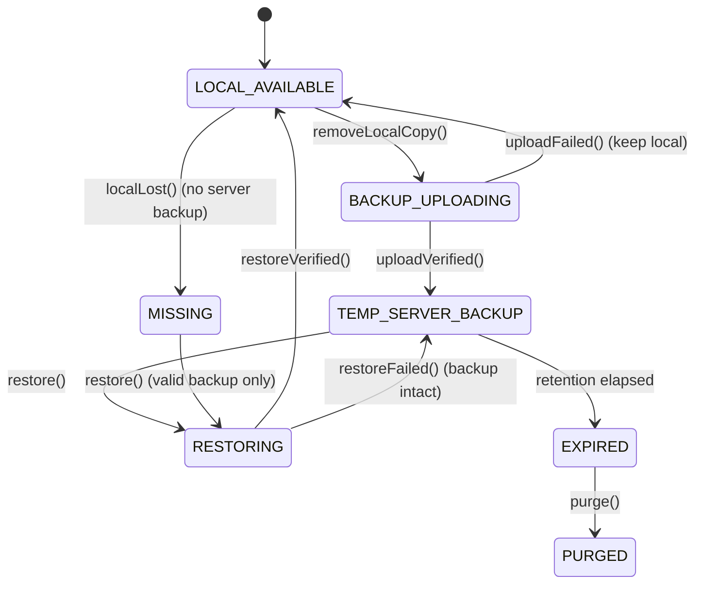

# FrontierX File Lifecycle

FrontierX is local-first: a managed encrypted copy of a file normally lives on the user's device. The server may hold an **opaque encrypted temporary backup** only after the user requests removal of the local encrypted copy, and only for a fixed retention window (default: 25 days).

## Concrete implementation boundary

### Browser-side storage

- The web client encrypts files before persistence and stores encrypted chunks plus local recovery material in IndexedDB, keyed by file ID.
- It asks the browser for persistent storage with `navigator.storage.persist()` when available. This is best-effort only: site-data clearing and browser eviction are still possible.
- The client never uploads file plaintext or file key material as part of the temporary-backup flow.

### Backup wire format

The server receives opaque bytes only. The serialized bundle is:

1. a four-byte big-endian encrypted-manifest length;
2. the serialized encrypted manifest;
3. length-prefixed encrypted chunks in manifest order.

The restore client rejects trailing bytes, an unexpected file ID, an invalid manifest, a missing chunk, tampered ciphertext, reordered chunks, and failed AEAD authentication.

### Server-side guards

- `backup/complete` rejects a lifecycle transition unless an encrypted blob has actually been uploaded.
- `backup/fail` rolls an unsuccessful upload back and removes the incomplete server blob.
- `restore/complete` deletes the temporary server blob only after local persistence and validation succeed.
- `restore/fail` keeps the server backup available when a pre-confirmation restore step fails.

The current blob store is a development store, not durable replicated object storage. The lifecycle protocol is real, but it does not create a production durability guarantee by itself.

## States (`FileReplica.state`)

- `LOCAL_AVAILABLE` — encrypted chunks are present in managed browser storage and can be decrypted on demand.
- `BACKUP_UPLOADING` — the user requested local removal; encrypted backup bytes are uploading. The local encrypted copy is retained.
- `TEMP_SERVER_BACKUP` — the upload was accepted and verified; the local encrypted bytes may be removed. `temp_expires_at = now + retention`.
- `RESTORING` — a temporary bundle is downloading, being parsed, authenticated, decrypted, and persisted locally.
- `MISSING` — the expected local copy is unavailable and no valid server backup is confirmed.
- `EXPIRED` — the retention window has elapsed and the server object is eligible for purge.
- `PURGED` — the server object is deleted; only metadata remains. This is terminal.

## Transitions

## Safety properties

1. **No early local deletion.** The client retains encrypted local chunks until blob upload succeeds and the server accepts `backup/complete`. An upload failure invokes rollback and retains the local copy.
2. **No early server deletion.** Restore downloads the opaque bundle, binds it to the requested file ID, validates the manifest and every AEAD chunk, writes the local encrypted copy, and only then sends `restore/complete`.
3. **Recoverable pre-confirmation failures.** A failed restore sends `restore/fail`; the temporary server backup remains available. A failed backup sends `backup/fail` and removes only the incomplete server copy.
4. **Expiry versus restore is guarded.** Once restoration begins, expiry may not purge it; once purged, restore is refused.
5. **Retention logic is deterministic in tests.** The domain layer uses an injected clock and covers day-20 warning, day-25 expiry, restore-before-expiry, and restore/expiry race behavior.

## Verification coverage

The automated suite covers encrypted file round trips, tamper detection, manifest and file-ID binding, opaque backup bundle parsing, uploaded-blob enforcement before backup completion, cleanup after confirmed restore, lifecycle transitions, quota limits, and permission checks. The browser implementation is typechecked and included in the production PWA build; browser end-to-end and visual QA remain outstanding.
